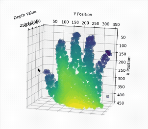

+++
date = '2025-10-24T22:09:06+02:00'
draft = true
title = 'Pixel avatar Part 1: Extracting depth from iPhone selfie'
series = ['Pixel Avatar']
categories = [ "pixel avatar"]
+++

I need an avatar for my blog's main page, but I don't want an ordinary selfie. I want something more dynamic and unique. How cool would it be to have a pixelated, animated 3D avatar of myself?


Unfortunately, I don't have the time or the specialized equipment to model my likeness properly. Then I remembered I already have a capable 3D scanning device in my pocket: an iPhone 15. It features LiDAR technology, which is widely used by various scanning apps, and it can create portrait photos with an adjustable focus. This means it must capture some sense of depth. Instead of using an existing app, I decided to try generating an avatar myself using the depth data from a photo.

What I used:
- iPhone 15 to take a photo in portrait mode
- Python with Pillow and pillow-heif libraries to extract depth data from a HEIC file

## Requirements
- Pixelated look
- Animated
- Capable of animated transitions between different models
- Lightweight enough to be displayed on a web page
- Minimal dependencies


## Depth from a HEIC file
High-Efficiency Image File Format (HEIC) is a format used by Apple to store photos. It can store multiple images in a single file, including a smaller depth image that is used to refocus a photo after it has been taken.

Let's take the photo below as an example.


We can iterate over all the depth images by running the following code:
```python
from PIL import Image
import pillow_heif

photo_file = pillow_heif.open_heif("original_photo.heic", convert_hdr_to_8bit=False)

for img_idx, img in enumerate(photo_file):
    print(f"Image [{img_idx}] size: {img.size}")
    depth_images = img.info["depth_images"]

    for depth_img_idx, depth_img in enumerate(depth_images):
        print(f"-> Depth [{depth_img_idx}] Image size: {depth_img.size}")
```
Output:
```text
Image [0] size: (4284, 5712)
-> Depth [0] Image size: (576, 768)
```
As we can see, there is one depth image with a different size from the original photo. Let's extract it and save it as a PNG file.
```python
depth_img.to_pillow().save("depth_image.png")
```


## Analyzing Depth Data

At first glance, all I can see is an outline of the hand. What I really want to know is whether the depth image has enough fine detail to reconstruct nearby objects. To look closely at the distribution of pixel values, I computed the following histogram.


From the histogram, I determined that the most interesting values are between 150 and 220. These account for the hand. Everything below 150 can be treated as background and therefore discarded. After normalizing the values, I was left with a much more detailed depth image of the hand.


While it is better, it still lacks some depth. I sampled random pixels, discarded the background values, and plotted them in 3D space.



## Next Steps
As I've shown, the depth data is promising but still requires some processing. Although it lacks fine details, it is sufficient to create the look I am aiming for.

 In the next part, I will try to export the pixels and display them in a browser.