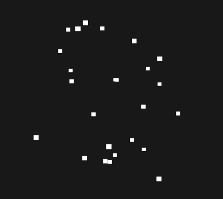
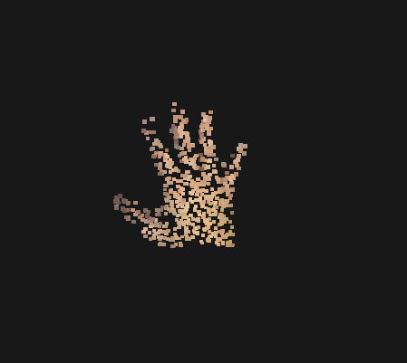
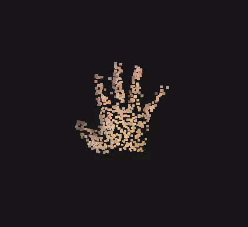

+++
date = '2025-10-24T22:09:06+02:00'
draft = true
title = 'Pixel avatar Part 2: '
series = ['Pixel Avatar']
categories = [ "pixel avatar"]
+++

In the previous part, I extracted depth data from a HEIC file taken with an iPhone 15. Now I need to figure out how to display it as a pixelated 3D avatar on my blog.

## Options for Displaying Points

What I want to achieve:
- Display 100-2000 points
- Animate the points to create a dynamic effect
- Each point should have a color sampled from the original image
- Have an jittering motion to give a lively appearance
- Be capable of transitioning between different models smoothly

There are several approaches I could take to display points:
| Approach               | Pros                                         | Cons                                         |
|------------------------|----------------------------------------------|----------------------------------------------|
| WebGL                  | High performance, fun | I don't have the time |
| Three.js               | High performance, easier to use, tweening and other features                 | Large dependency, less fun          |
| CSS 3D transforms  | No dependencies    | Performance could be an issue      |
| Pre-rendered animation | No dependencies, easy, can display anything | No interactivity, boring as hell, why even bother? |

Well, looks like Three.js is the best option here. At least this post won't end up being about reiventing matrix multiplications.

## Displaying Points with Three.js

The library providers a lot of examples and features. I was considering using vertices to display points, but I found that the library comes with a built-in type called `Sprite`, which is perfect for displaying pixelated points. On top of that, sprites are always facing the camera, which is even better.

```typescript
// Since this is not a THREE.js tutorial, I'll skip the setup part.
camera.position.z = 3;

for (let i = 0; i < 25; i++) {
    const spriteMaterial = new THREE.SpriteMaterial({ color: '#FFFFFF' });
    const sprite = new THREE.Sprite(spriteMaterial);

    sprite.scale.set(0.05, 0.05, 0.05);
    sprite.position.set(
        Math.random() * 2.0 - 1.0, // x
        Math.random() * 2.0 - 1.0, // y
        Math.random() * 2.0 - 1.0, // z - this will be set using depth data later
    );

    scene.add(sprite);
}

let animate = function () {
    renderer.render(scene, camera);
};

renderer.setAnimationLoop(animate);
```
Which renders something like this:


Now I need to serialize the depth and color data from the photo, export it as JSON, and load it in the Three.js application.

## Displaying Exported Data
Since I want to keep things simple, I won't use any complex formats for storing 3D models. A simple JSON file is more than enough. I don't want to deal with additional dependencies. Some tweaking was needed to get the right scale and orientation.
```json
[
    {
        
        "position" : [0.1, 0.2, 0.3],
        "color": "#FF00FF"
    },
]
```

Iterating over the points and creating sprites for each of them with specific color is straightforward. I tried it with the photo from the previous post, and here is the result:



## You Rotate Me Right Round
Let's add some camera rotation to make it more dynamic.
//TODO code snippet



## Tween baby, Tween!
I wannt to have smooth transitions between different models. Usually, I would try to simulate movement by updating postions in the animation loop. However, for more complex animations with predictible timing and easing functions, it is better to just use a tweening library. I chose [tween.js](https://github.com/tweenjs/tween.js).