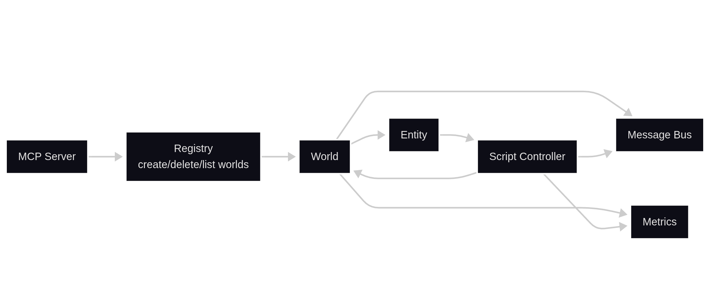
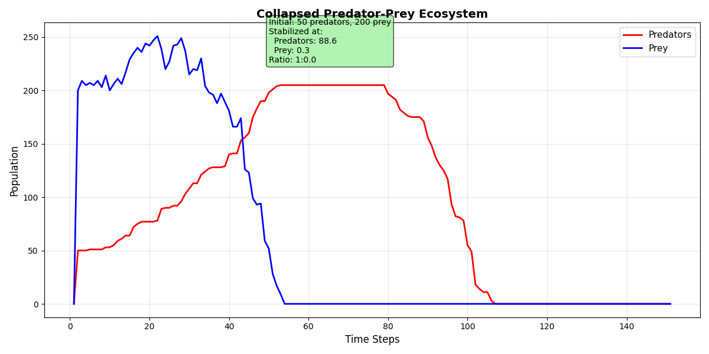

+++
date = '2025-12-24T22:09:06+02:00'
draft = true
title = 'Agent Simulation Framework for LLMs'
+++

_This article was not written by an AI. I only use LLMs to help me with grammar and spelling._

## TL;DR
I built a scriptable framework for LLMs to create and run agent based simulations to reason about complex systems and emergent behaviour. Skip to [It's simulation time!](#its-simulation-time) to see examples of LLMs using the framework.

Project is open source and available on [https://github.com/MartinKuzma/vivarium](https://github.com/MartinKuzma/vivarium)

## Motivation
I always wanted to dig deeper into **agent based simulations**. Namely to understand how complex behaviours can emerge and to model economic and social systems. Building such simulations is hard so I never got around to it. In my imagination, I always pictured that I can just tell an AI to simulate something for me just like **Tony Stark** did. Wait a minute! We have capable LLMs now! And they can write code and use tools!

What if the agents are written by LLMs so that they can run and design simulations by themselves? **This would enable LLMs to reason about complex systems by simulating them and observing emerging behaviour.** Wanna let your favorite LLM to figure out which strategy is the best to solve a problem? Let it come up with the model and experiment with it!

Main benefits of this approach would be:
- LLMs don't have to write simulation code from scratch (less tokens used)
- LLMs can restore and modify simulation state on the fly, enabling dynamic experimentation
- With fully focused on agent's implementations, context window won't be wasted on mundane simulation code

Since I'm using Github Copilot, I can't determine the exact token usage. It is also not clear how to compare it to a scenario where LLMs write the whole simulation code as it would most likely try to create a different kind of simulation.

## Rough Architecture
I need to build a tool framework usable by LLMs so that they can easily create agents, environments, and run simulations.

What I have in mind is something like this:
- MCP server to run the simulations
- Simulation runtime (Rust) that can start/stop simulations, manage agents and environments
- Scripting language to write agents and environments
- Observability of the simulation state so that LLMs can reason about it
- Discrete simulation steps so that LLMs can control the pace of the simulation
- Entities are decoupled by messages. Messages should be compatible with other scripting languages in the future.

For simulation itself I was planning to use a simple system in which agents can send each other messages and interact with the environment. However, I couldn't bear the thought of doing something so basic, so I decided to complicate my life by adding **Entity Component System** (ECS) architecture to the mix. 

I didn't want to use any existing ECS libraries - I wanna learn! As it turns out, making an performant ECS system in Rust is quite painful. I wasn't satisfied but it was somewhat working, however I realized that I was trying to solve a different problem. ECS is great for games where you can leverage data locality, but in my case I only need to manage scripts and expose some API to them. Back to square one.

I ended up making a simple entity system where each entity has a script controller that runs the script. Entities can send messages to each other via message bus and issue commands to mutate the world state.


| Component       | Description                                                  |
|-----------------|--------------------------------------------------------------|
| MCP Server      | Exposes tools for LLM to use |
| Registry        | Manages multiple simulation instances                        |
| World           | Represents a single simulation instance                      |
| Entity          | Represents an agent or environment in the simulation         |
| Message Bus     | Schedules and delivers messages between entities             |
| Script Controller| Runs script representing behavior                           |
| Metrics       | Collects and exposes simulation metrics                       |

## Scripting Language
To enable LLMs to write agents and environments, I need a scripting language that is easy to use and understand. I wanted to use isolated enviroments so that agents can run independently without interfering with each other. The usual suspects for this are:
- Python
- JavaScript
- Lua

Tough choice. So I asked an anonymous LLM which one it would prefer. The answer was Lua, for its simplicity and performance. So Lua it is!

I used mlua as the Lua interpreter. Each entity has its own Lua VM instance. The script can call predefined API functions to interact with the world:
| Function | Description |
|----------|-------------|
| world.list_entities() | Returns a table of all entity IDs in the simulation |
| world.record_metric(name, value) | Record a custom metric value for analysis |
| self.id | The unique ID of the current entity |
| self.send_msg(receiver_id, kind, content, delay) | Send a message to another entity with an optional delay (in simulation steps) |
| self.destroy(entity_id) | Destroy an entity by its ID |
| self.spawn_entity(entity_id, script_id, initial_state) | Spawn a new entity with the given Lua script and initial state |

Example Lua script:
```lua
health = 100
x = 0
y = 0

function update(current_time, msgs)
    -- Process incoming messages
    for _, msg in ipairs(msgs) do
        -- Handle message.kind and message.content
    end
    
    -- Send messages to other entities
    self.send_msg(target_id, msg_type, {field = "value"})
end

function get_state()
    -- Return entity state as Lua table
    return {health = health, position = {x = x, y = y}}
end

function set_state(state)
    -- Restore entity state from Lua table
    health = state.health
    x = state.position.x
    y = state.position.y
end
```
## Main simulation loop
I kept it simple and straightforward. Each tick represents a simulation step. Each step, any deliverable messages (meaning messages that were scheduled for delivery at the current simulation time) are delivered. I used command pattern to represent actions retrieved from agents. That way entities are not performing any mutations directly, but rather by issuing commands.

The loop (at the moment of writing) looks something like this:
```
1. Update simulation time
2. Deliver scheduled messages for the current time
3. For each entity:
   - Call update method with current simulation time
   - Collect commands issued by the entity
4. Process all collected commands
```
Nothing too fancy. Parallelization is not my concern at the moment, but it can be added later. The current simulation loop allows for parallel execution of entities.

## Enabling multiple scripting languages
To make the scripting language swappable, I had to define messages and states in a language agnostic way. I used serde's Value type to represent states and messages. This way, it is scripting runtime's responsibility to transform the data into the Value type and back. The Value basically represents JSON data, allowing me to directly use it in MCP tools and persistence without changing a thing.

## MCP Server
For those who don't know, MCP (Model Context Protocol) is a protocol for LLMs to interact with external tools. It is all the rage nowadays. Or at least was few months ago.

### Tools
I wanted to give LLMs everything they need to properly manage simulations. I even added snapshotting so that LLMs can save and restore simulation states.

| Name | Description |
|------|-------------|
| create_world | Create a new simulation world with the specified configuration |
| delete_world | Delete an existing simulation world by name |
| copy_world | Copy an existing simulation world to a new world with the specified name |
| list_worlds | List all existing simulation worlds |
| list_entities | List all entities currently in the simulation. Returns their IDs which can be used as targets for sending messages. |
| advance_simulation | Advance the simulation by running multiple time steps. Each step processes pending messages and executes entity update() functions. |
| get_world_state | Get the overall state of the simulation world, including simulation time, entity count, and pending message count. |
| set_entity_state | Set the state of a specific entity by its ID. The state must be a JSON object compatible with the entity's Lua script. |
| get_entity_state | Get the current state of a specific entity by its ID. |
| list_metrics | List the names of all available metrics in the simulation world. |
| get_metric | Get the current values of a specific metric by name. |
| get_metrics | Get the current values of multiple metrics by their names. |
| create_world_snapshot | Create a snapshot of the current state of the simulation world, including entity states and pending messages. |
| restore_world_snapshot | Restore a simulation world to a previously created snapshot state. |
| save_world_snapshot_to_file | Save a simulation world snapshot to a YAML file. |
| load_world_snapshot_from_file | Load a simulation world snapshot from a YAML file. |

## It's simulation time!
With MCP server and simulation runtime ready, it's time to let LLMs reason!

### Example: Predator-Prey Model

| Parameter | Value |
|-----------|-------|
| Model | Claude Sonnet 4.5 |
| Environment | Copilot in VSCode |
| Prompt | _Create a simulation of a simple ecosystem with predators and prey. Determine at which rate the predator population stabilizes given an initial population of 50 predators and 200 prey. After finalizing the simulation, save a snapshots of the worlds to local files. #vivarium_ |

#### Result
At first, it tried to create a simple predator-prey model. However, advancing the simulation failed due to incorrect parameters. It was able to fix the issue by searching for the correct parameters in the source code. I discovered that the instructions were not up to date. Mea culpa. Experiment was still running regardless. It created a new simulation model that collapsed after 50 steps due to overhunting. Then it tried to fix the model by adjusting the parameters and adding a carrying capacity for the prey population. This part felt like **cheating**, but end goal is to verify the whole concept of LLMs designing and running simulations, so I will let it slide this time.

The model consisted of three scripts: spawner, prey and predator. The spawner was responsible for spawning the initial population. It was also responsible for collecting metrics about the population and recording them. Interesting approach! 
Full snapshot of the balanced simulation can be downloaded from [here](ecosystem_stable_snapshot.yaml).


```lua
spawned = false

function update(current_time, msgs)
    if not spawned then
        for i = 1, 200 do
            local prey_id = "prey_" .. i
            self.spawn_entity(prey_id, "prey_script", {energy = 100, age = math.random(0, 35), reproduction_cooldown = math.random(0, 18), next_offspring_id = 1})
        end
        
        for i = 1, 50 do
            local pred_id = "predator_" .. i
            self.spawn_entity(pred_id, "predator_script", {energy = 100, age = math.random(0, 40), reproduction_cooldown = math.random(0, 40), hunt_cooldown = math.random(0, 8), next_offspring_id = 1})
        end
        
        spawned = true
    end
    
    local all_entities = world.list_entities()
    local prey_count = 0
    local predator_count = 0
    
    for _, entity_id in ipairs(all_entities) do
        if entity_id:sub(1, 4) == "prey" then
            prey_count = prey_count + 1
        elseif entity_id:sub(1, 8) == "predator" then
            predator_count = predator_count + 1
        end
    end
    
    world.record_metric("prey_population", prey_count)
    world.record_metric("predator_population", predator_count)
    world.record_metric("total_population", prey_count + predator_count)
    
    if prey_count > 0 then
        world.record_metric("predator_prey_ratio", predator_count / prey_count)
    end
end

function get_state()
    return {spawned = spawned}
end

function set_state(state)
    spawned = state.spawned
end
```



```lua
energy = 100
age = 0
reproduction_cooldown = 0
next_offspring_id = 1
MAX_PREY = 300

function update(current_time, msgs)
    age = age + 1
    
    local eaten = false
    for _, msg in ipairs(msgs) do
        if msg.kind == "hunt" then
            eaten = true
            break
        end
    end
    
    if eaten then
        self.destroy(self.id)
        return
    end
    
    energy = energy + 6
    if energy > 150 then
        energy = 150
    end
    
    if age > 110 or energy <= 0 then
        self.destroy(self.id)
        return
    end
    
    if reproduction_cooldown > 0 then
        reproduction_cooldown = reproduction_cooldown - 1
    end
    
    -- Check prey population before reproducing
    if energy > 95 and age > 9 and reproduction_cooldown == 0 then
        local all_entities = world.list_entities()
        local prey_count = 0
        
        for _, entity_id in ipairs(all_entities) do
            if entity_id:sub(1, 4) == "prey" then
                prey_count = prey_count + 1
            end
        end
        
        if prey_count < MAX_PREY then
            local offspring_id = "prey_" .. self.id .. "_" .. next_offspring_id
            next_offspring_id = next_offspring_id + 1
            energy = energy - 38
            reproduction_cooldown = 18
            self.spawn_entity(offspring_id, "prey_script", {energy = 75, age = 0, reproduction_cooldown = 9, next_offspring_id = 1})
        end
    end
end

function get_state()
    return {energy = energy, age = age, reproduction_cooldown = reproduction_cooldown, next_offspring_id = next_offspring_id}
end

function set_state(state)
    energy = state.energy
    age = state.age
    reproduction_cooldown = state.reproduction_cooldown
    next_offspring_id = state.next_offspring_id or 1
end
```



```lua
energy = 100
age = 0
reproduction_cooldown = 0
hunt_cooldown = 0
next_offspring_id = 1
MAX_PREDATORS = 100

function update(current_time, msgs)
    age = age + 1
    energy = energy - 2.5
    
    if age > 180 or energy <= 0 then
        self.destroy(self.id)
        return
    end
    
    if hunt_cooldown > 0 then
        hunt_cooldown = hunt_cooldown - 1
    end
    
    if hunt_cooldown == 0 and energy < 110 then
        local all_entities = world.list_entities()
        local prey_list = {}
        
        for _, entity_id in ipairs(all_entities) do
            if entity_id:sub(1, 4) == "prey" then
                table.insert(prey_list, entity_id)
            end
        end
        
        if #prey_list > 0 and math.random() < 0.6 then
            local target = prey_list[math.random(#prey_list)]
            self.send_msg(target, "hunt", {hunter = self.id}, 0)
            energy = energy + 35
            hunt_cooldown = 8
        end
    end
    
    if reproduction_cooldown > 0 then
        reproduction_cooldown = reproduction_cooldown - 1
    end
    
    -- Check predator population before reproducing
    if energy > 135 and age > 20 and reproduction_cooldown == 0 then
        local all_entities = world.list_entities()
        local predator_count = 0
        
        for _, entity_id in ipairs(all_entities) do
            if entity_id:sub(1, 8) == "predator" then
                predator_count = predator_count + 1
            end
        end
        
        if predator_count < MAX_PREDATORS then
            local offspring_id = "predator_" .. self.id .. "_" .. next_offspring_id
            next_offspring_id = next_offspring_id + 1
            energy = energy - 65
            reproduction_cooldown = 40
            self.spawn_entity(offspring_id, "predator_script", {energy = 85, age = 0, reproduction_cooldown = 20, hunt_cooldown = 8, next_offspring_id = 1})
        end
    end
end

function get_state()
    return {energy = energy, age = age, reproduction_cooldown = reproduction_cooldown, hunt_cooldown = hunt_cooldown, next_offspring_id = next_offspring_id}
end

function set_state(state)
    energy = state.energy
    age = state.age
    reproduction_cooldown = state.reproduction_cooldown
    hunt_cooldown = state.hunt_cooldown
    next_offspring_id = state.next_offspring_id or 1
end
```


This is how it interpreted the results:
```markdown
Simulation Complete!
Answer: The predator population stabilizes at approximately 100 individuals (range: 87-109 with natural oscillations).

Key Results:
Balanced Ecosystem (ecosystem_stable):

✅ Achieved stable equilibrium at ~100 predators
Steps 301-325: Perfect stability at exactly 100 (carrying capacity)
Steps 326-400: Stable oscillations 87-109 (mean ~100)
Prey population: ~430-510 individuals
Predator:Prey ratio: ~1:4 to 1:5
Collapsed Ecosystem (ecosystem_model):

❌ Complete extinction by step 107
Prey extinct at step 54 (overhunting)
Predators peaked at 205, then starved
Too aggressive hunting/reproduction parameters
Snapshots Saved:
ecosystem_stable_snapshot.yaml (165 KB) - Stable system at step 400
ecosystem_collapsed_snapshot.yaml (17 KB) - Failed system (extinct)
ECOSYSTEM_SIMULATION_RESULTS.md - Detailed analysis
The stable ecosystem achieved equilibrium through:

Carrying capacity constraints (max 100 predators, 300 prey)
60% hunt success rate (vs 100% in failed model)
Longer reproduction cooldowns (40 vs 30 steps)
Balanced energy dynamics
```




My conclusion is that the simulation was successful in demonstrating the ability of LLMs to design and run agent-based simulations. Some inefficiencies in the model can be addressed by adding lua functions. I might need to reconsider the way how the simulation is stored so that LLMs can work on it more efficiently. For example, split the configurations and scripts into separate files.

## Where to go from here?
This project's scope is beyond of what I can implement right now. I could go on indefinitely adding features. At this stage, it is more or less usable, but there are many things that could be improved.

Here are some ideas for future improvements:
- Better observability
- CLI tool for advancing the simulation without using MCP
- Resources (representing various consumables in the simulation)
- Spatial environments (2D/3D grids)

Right now it can be found on GitHub [https://github.com/MartinKuzma/vivarium](https://github.com/MartinKuzma/vivarium) and is open source under MIT license. Feel free to contribute or use it for your own projects!